# Proyecto: Tienda Deportiva - Rivelli Store

Este proyecto consiste en una página web para una tienda deportiva con diversas funcionalidades implementadas utilizando Django y Bootstrap. A continuación, se detalla el orden en el que se deben probar las funcionalidades y el contenido de cada página.

## Índice

1. [Requisitos Previos](#requisitos-previos)

2. [Instalación](#instalación)

3. [Ejecución del Proyecto](#ejecución-del-proyecto)

4. [Herramientas Utilizadas](#herramientas-utilizadas)

5. [Páginas y Funcionalidades](#páginas-y-funcionalidades)

    1. [Página Inicio](#1-página-de-inicio)

    2. [Página Sobre Nosotros](#2-página-sobre-nosotros)

    3. [Página Productos](#3-página-productos)

    4. [Páginas Ver Vendedores y Ver Clientes](#4-páginas-ver-vendedores-y-ver-clientes)

    5. [Página Contáctanos](#5-página-contáctanos)

    6. [Página Ingresar](#6-página-ingresar)

    7. [Páginas Enviar Mensaje y Ver Mensajes](#7-páginas-enviar-mensajey-ver-mensajes)

    8. [Páginas Ver y Editar Perfil y Cambiar Contraseña](#8-páginas-ver-perfil-editar-perfil-y-cambiar-contraseña)

    9. [Página Registrarse](#9-página-registrarse)

6. [Video Demostración de la Página](#video-demostración-de-la-página)

## Requisitos Previos
- Python 3.10 o superior
- Django 4.0 o superior
- Bootstrap 5 integrado en el proyecto

## Instalación

1. Clonar el repositorio

```py
git clone https://github.com/usuario/rivelli-store.git
cd rivelli-store
```

2. Instalar las dependencias:

```py
pip install -r requirements.txt
```

3. Realizar las migraciones para configurar la base de datos:

```py
python manage.py makemigrations
python manage.py migrate
```

## Ejecución del Proyecto

1. Ejecuta el servidor de desarrollo:

```py
python manage.py runserver
```

2. Acceder a la página web en el navegador en la URL:

```py
http://127.0.0.1:8000/
```

## Herramientas utilizadas

### Lenguajes de Programación


---

### Frameworks y librerías


---

### Entorno de desarrollo integrados / Editores


---

### Control de versiones


## Páginas y Funcionalidades

Todas las páginas cuentan con una barra de navegación en la parte superior, con botones para dirigirse a otras páginas y un menú desplegable para ingresar a las páginas de **vendedores** y **clientes**

En el pie de cada página se encuentran `Botones de redes sociales` que redirigen a las diferentes redes sociales e información de contacto.

---

### 1. Página de Inicio

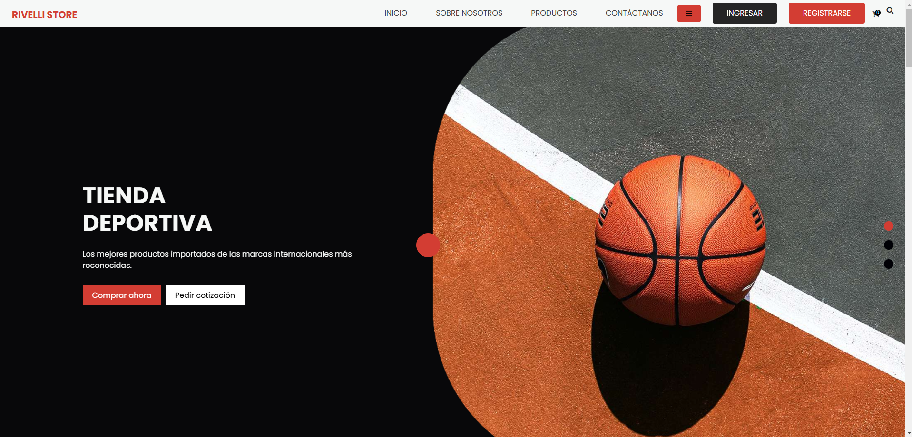

#### Ruta: `/`

En la **página principal** se puede visualizar:

- Carrusel de imagenes al principio y otro de opiniones de clientes al final, ambos funcionales.

- Botones disponibles:

    - `Comprar ahora` →  Redirige a la página de **productos**.
    
    - `Pedir cotización` → Redirige al **formulario de contacto**.

    - `Ver todo` → Redirige a la página de **productos**.

---

### 2. Página Sobre Nosotros

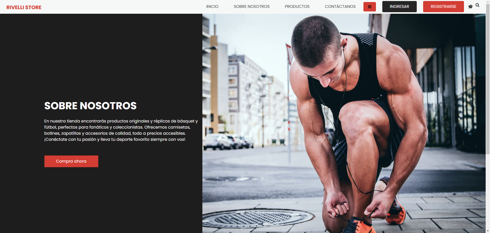

#### Ruta: `/about/`

En la **página Sobre Nosotros** se encuentra:

- Una breve descripción sobre la tienda.
- Botón de `Comprar ahora`, que redirige a la página de **productos**

---

### 3. Página Productos

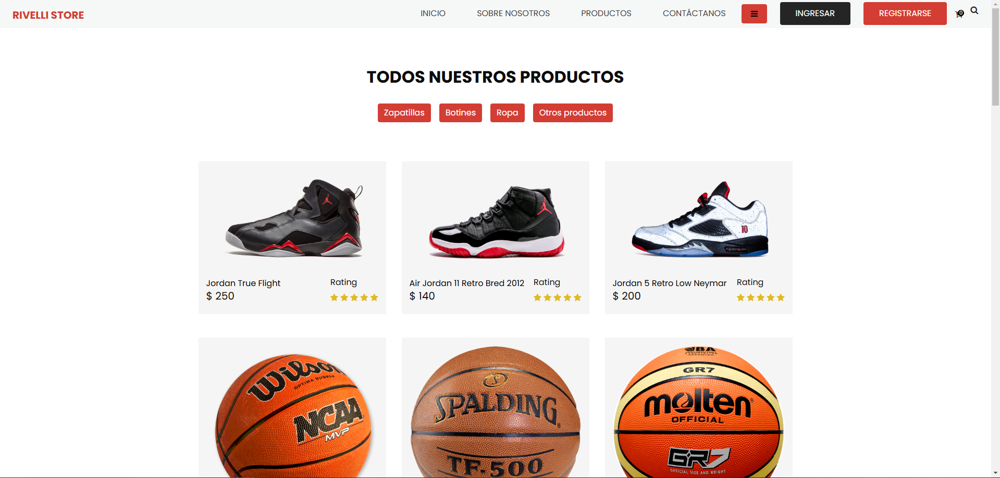

#### Ruta: `/product/`

Características de la **página Productos**:

- Muestra en `HTML` de los productos.

- Botones para ir a las páginas de: `Zapitllas`, `Botines`, `Ropa` y `Otros productos`:


    | 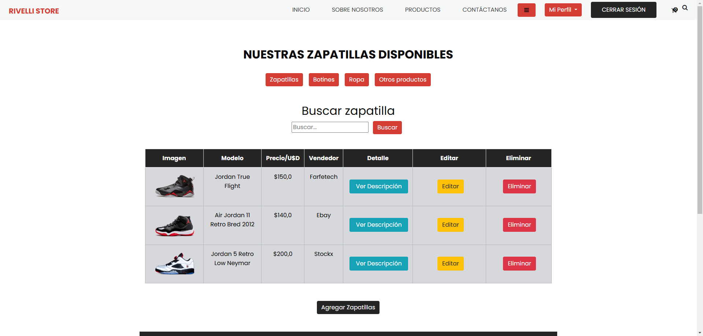 | 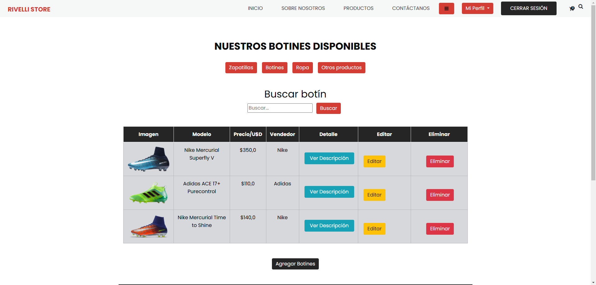 |
    | --- | --- |
    |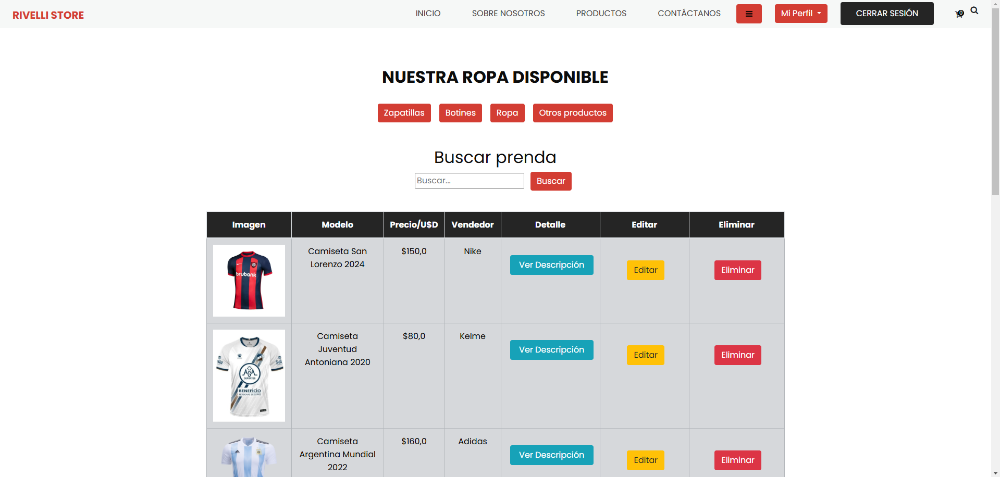 | 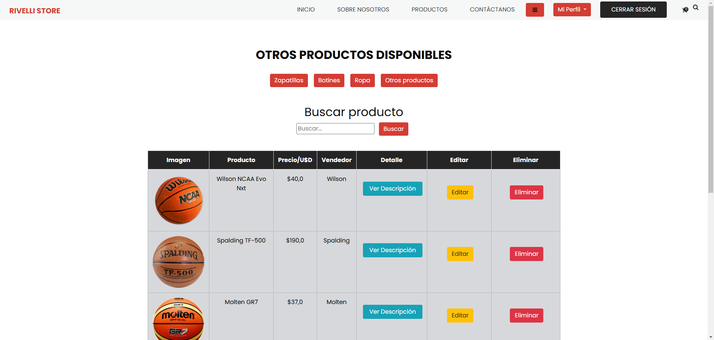 |

    Cada una de estas páginas cuentan con:

    - **Tablas** para visualizar los productos registrados con sus detalles.

    - Una **barra de búsqueda** para buscar según el **nombre** o **modelo** del producto.

    - **Botones** para **Ver Descripción**, **Editar** y/o **Eliminar** el producto registrado. Los botones de **Editar** y **Eliminar** solo los puede usar un **superusuario**, mientras que cualquier otro tipo de usuario, incluso alguien que no esté registrado, podrá usar el botón de **Ver Descripción**.

    - Un **botón** que redirige a un formulario para registrar un nuevo producto, según el tipo que corresponda: 

    | 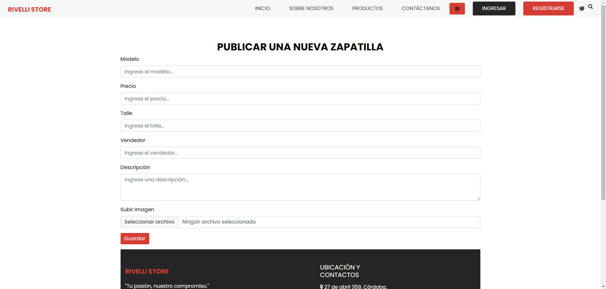 |  |
    | --- | --- |
    |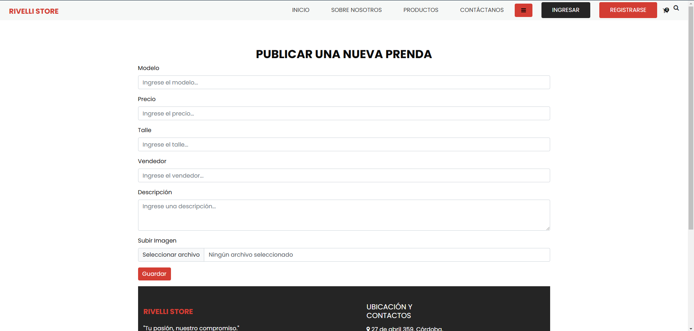 | 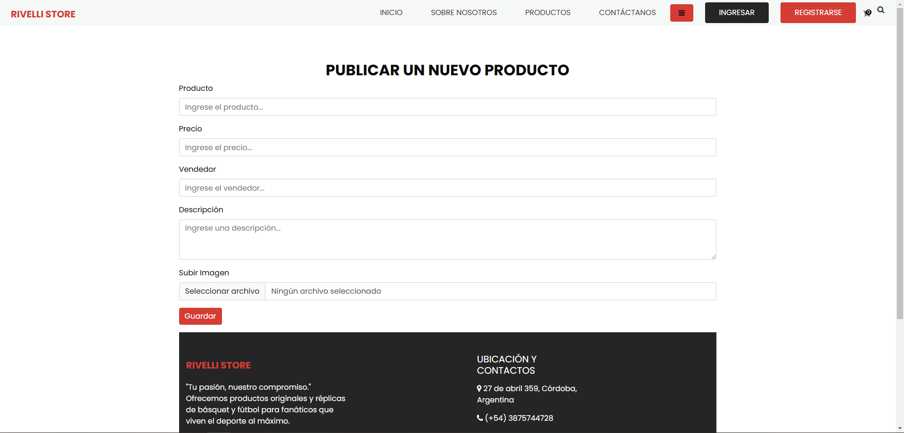 |

    En estas páginas hay:

    - Campos para completar con ``Modelo/Producto``, `Precio`, ``Talle``, ``Vendedor``, ``Descripción`` y cargar una ``Imagen``.

    - Una vez que se hayan cargado los datos correctamente, haciendo clic en el botón `Guardar`, se redirecciona al usuario a una página de confirmación de registro de producto exitoso.
    
    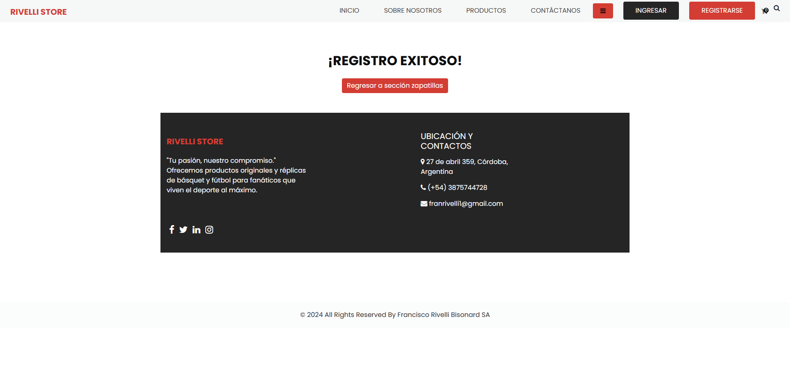

    Por útlimo, haciendo clic en el botón `Regresar a sección...`, se redirecciona a la página **Zapatillas**, **Botines**, **Ropa** u **Otros Productos** (según corresponda), donde se puede visualizar el producto recientemente registrado.

---

### 4. Páginas Ver Vendedores y Ver Clientes

#### Rutas: `/vendedores/` y ``/clientes/``

|  | 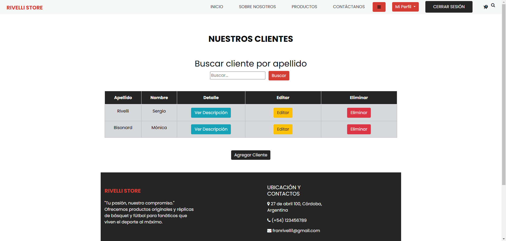 |
| --- | --- |

Tienen la misma estética y funcionalidad que las páginas de **Zapatillas**, **Botines**, **Ropa** y **Otros Productos**. Cuentan con:

- **Tablas** para visualizar los **Vendedores** o **Clientes** registrados con sus detalles.

- Una **barra de búsqueda** para buscar según el **apellido** de cada **Vendedor** o **Cliente**.

- Un **botón** que redirige a un formulario para registrar un nuevo **cliente** o **vendedor**, según el tipo que corresponda: 

| 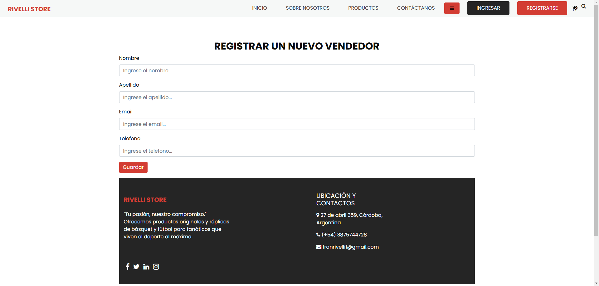 |  |
| --- | --- |

En estas páginas hay:

- Campos para completar con ``Nombre``, `Apellido`, ``Email`` y ``Telefono`` del nuevo **vendedor** o **cliente**.

- Una vez que se hayan cargado los datos correctamente, haciendo clic en el botón `Guardar`, se redirecciona al usuario a una página de confirmación de registro de **vendedor** o **cliente** exitoso.


Por útlimo, haciendo clic en el botón `Regresar a sección...`, se redirecciona a la página **Ver Vendedores** o **Ver Clientes** (según corresponda), donde se puede visualizar el nuevo registro.

---

### 5. Página Contáctanos

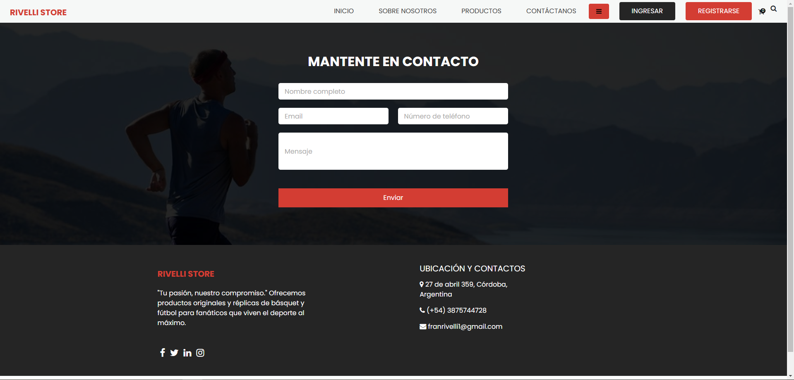

#### Ruta: `/contact/`

Esta página contiene un formulario para que el usuario se ponga en contacto con la tienda y pueda, por ejemplo, pedir una cotización.

El registro que realiza el usuario se puede visualizar en la base de datos `db.sqlite3` en la tabla `app_tienda_contacto`  o en la ruta `/admin/app_tienda/contacto/` ingresando con el superusuario **fran** y la contraseña **1**.

---

### 6. Página Ingresar

#### Ruta: `/inicio_sesion/`

En esta página podemos iniciar sesión en la tienda. Se puede observar un formulario que nos pide el nombre de ``usuario`` y la ``contraseña``.

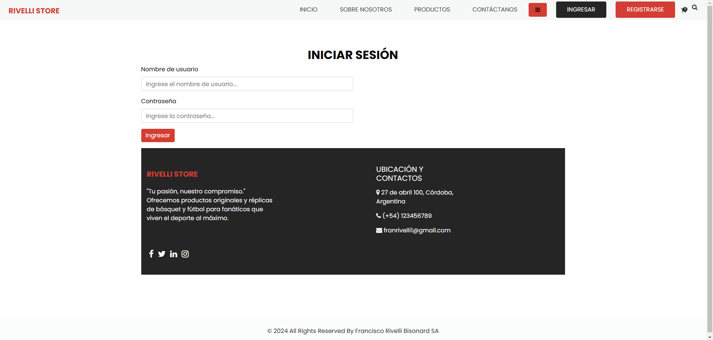

Luego de hacer clic en el botón **Ingresar**, nos redirecciona a la página de **Inicio** y nos aparecerá un mensage tipo *toast* en el margen inferior derecho con el mensaje de ingreso exitoso.

---

### 7. Páginas Enviar Mensajey Ver Mensajes

#### Rutas: ``/mensajes/enviar_mensaje/`` y ``/mensajes/mostar_mensajes/``

En estás páginas podemos enviar y ver los mensajes recibidos en nuestra cuenta, respectivamente. En ambas páginas, debemos tener iniciada nuestra sesión para ingresar. 

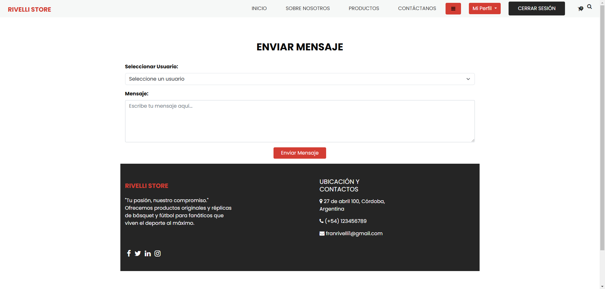

En la página **Enviar Mensaje** tenemos un formulario para enviar un mensaje. 

Tendremos un campo desplegable que nos permite ver los demás usuarios registrados para enviar el mensaje. El otro campo es el mensaje, donde pondremos lo que queremos decirle al otro usuario. Una vez que enviamos el mensaje, nos redirecciona a la página de **Ver Mensajes**.

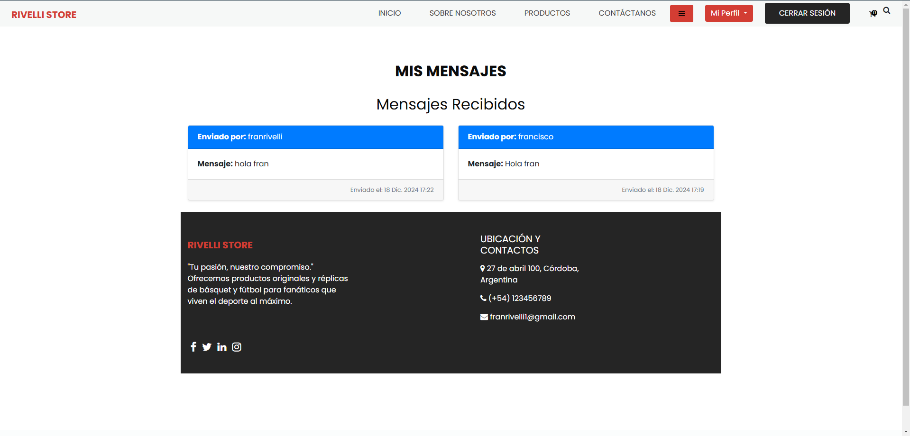

En **Ver Mensajes** podemos ver los mensajes que hemos recibido.

Tendremos una tarjeta que nos dice:

- El usuario que nos envió el mensaje.

- El mensaje enviado.

- Fecha en la que se envió el mensaje.

---

### 8. Páginas Ver Perfil, Editar Perfil y Cambiar Contraseña

#### Rutas: ``/mostrar_perfil/``, ``/editar_perfil/`` y ``/cambiar_contraseña/``

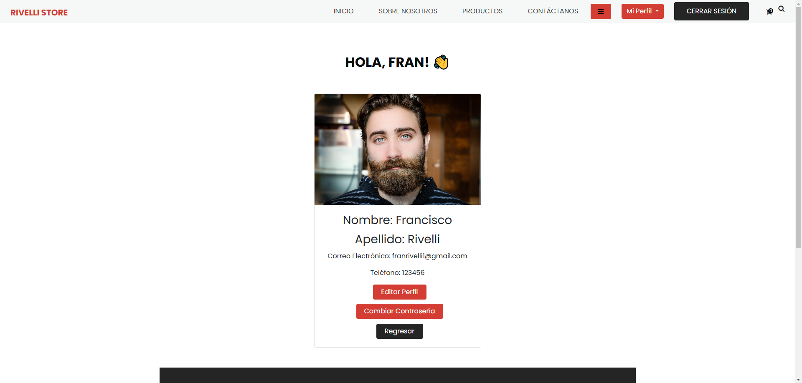

En la página **Ver Perfil** podemos ver los datos de nuetro perfil, a modo de tarjeta:

- Un avatar o foto de perfil.

- Nombre y apellido.

- Correo Electrónico.

- Teléfono.

Además, tenemos los botones para **Editar Perfil**, **Cambiar Contraseña** y **Regresar**. Este útlimo nos redirecciona a la página **Inicio**.

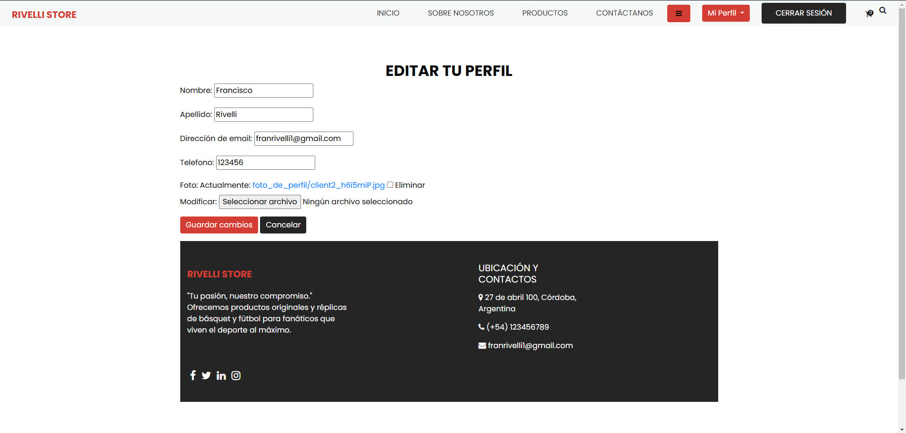

Tenemos un formulario que nos permite editar el perfil.

- Cambiar Nombre y Apellid.

- Correo electrónico.

- Teléfono.

- Cambiar o eliminar la foto de perfil.

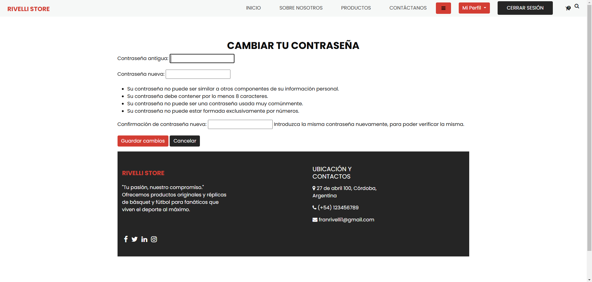

Formulario para actualizar la contreseña:

- Nos pide poner la contraseña actual.

- Una contraseña nueva y la confirmación de esta.

---

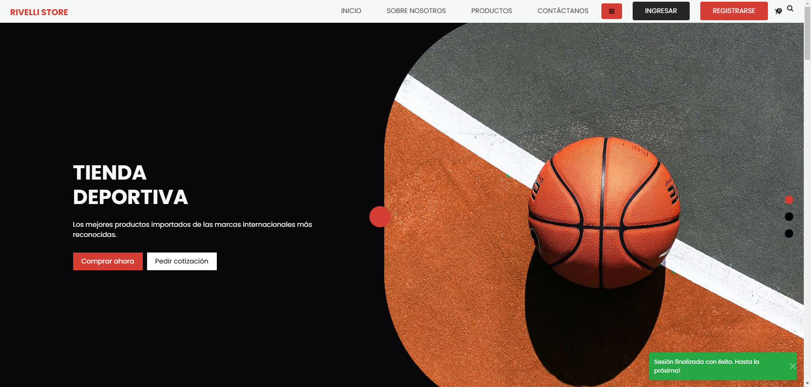

Cuando cerramos sesión, nos sale un mensaje tipo toast, en el margen inferior derecho, con la confirmación de que la sesión está cerrada y nos redirige a la página de **Inicio**.

---

### 9. Página Registrarse

#### Ruta: **/registro_usuario/**

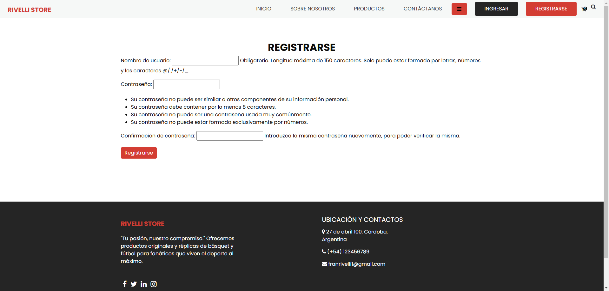

Aquí podremos registrar un nuevo usuario con el siguiente fomrulario:

- Nombre de usuario (**Obligatorio**)

- Contraseña y Confrimación de contraseña (**Obligatorios**).

Cada uno de estos campos tienen requisitos específicos a cumplir, que en caso de no respetarlos no podremos registrar el usuario.

---

## Video demostración de la página

[](https://www.youtube.com/watch?v=9eBWMZbrQsI)